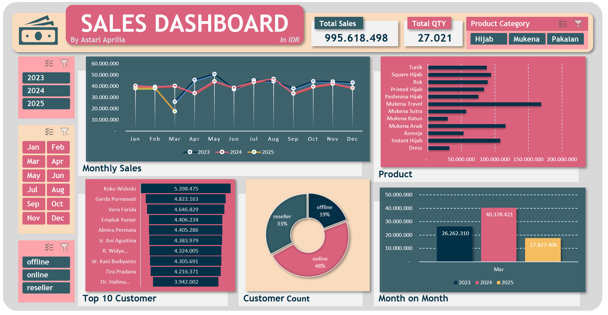

# ✨ Muslimah Store Sales Data 🧕✨

💻 Project Details:
- Data Generation: I utilized the Faker library in Python to simulate sales data.
- Data Processing: The generated data was exported into an Excel file.
- Dynamic Visualization: I developed a dynamic dashboard in Excel to make the sales analysis more interactive and user-friendly.

## ✨ Excel Dashboard

